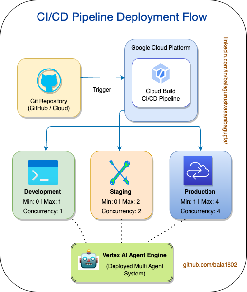
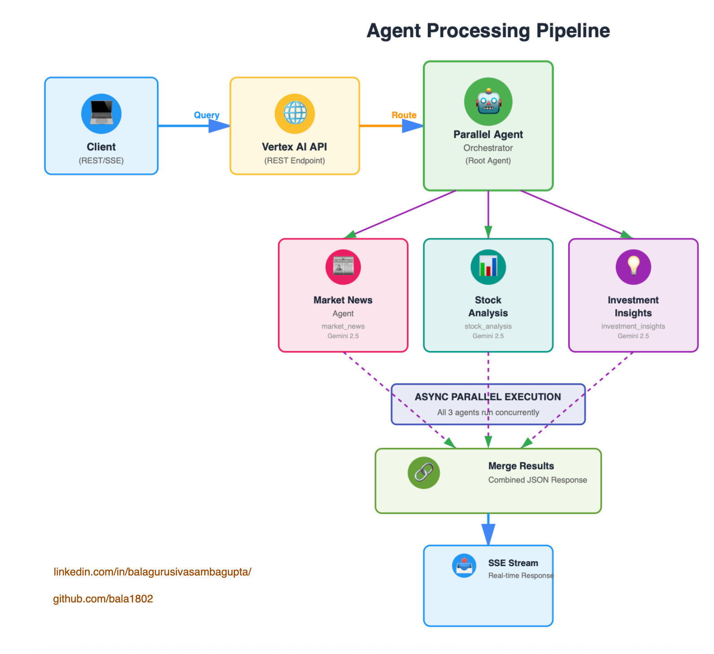
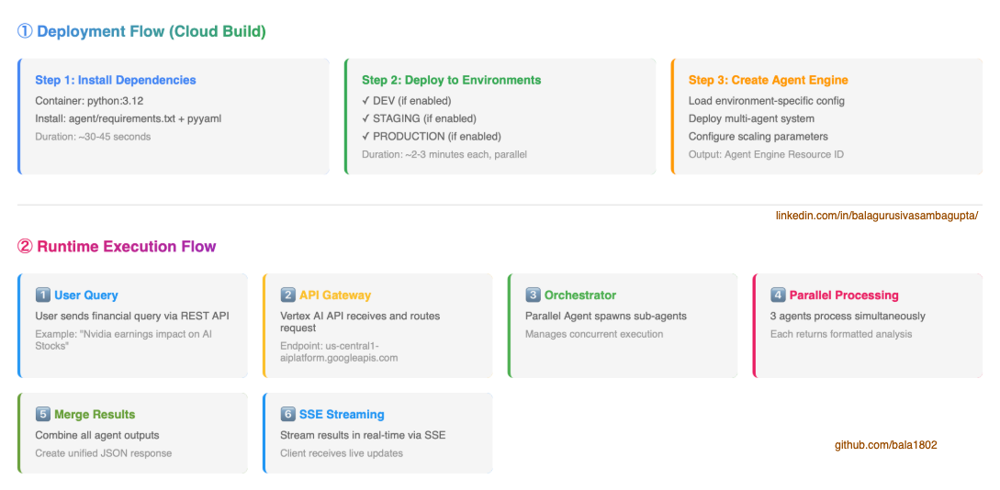

# Vertex AI Agent Engine CI/CD Pipeline Demo


A production-ready **CI/CD pipeline** for deploying **Google Vertex AI Agent Engine** applications using **Google Cloud Build**. This repository demonstrates best practices for automated deployment across dev, staging, and production environments with multi-agent orchestration.

## 📋 Table of Contents

- [Project Overview](#project-overview)
- [Architecture](#architecture)
  - [High-Level Architecture](#high-level-architecture)
  - [Low-Level Architecture](#low-level-architecture)
  - [Agent Topology](#agent-topology)
- [Repository Structure](#repository-structure)
- [Features](#features)
- [Prerequisites](#prerequisites)
- [Quick Start](#quick-start)
- [Configuration](#configuration)
- [Deployment](#deployment)
  - [Local Development](#local-development)
  - [Cloud Build Pipeline](#cloud-build-pipeline)
  - [Environment-Specific Deployments](#environment-specific-deployments)
- [Agent Specifications](#agent-specifications)
- [Testing](#testing)
- [Troubleshooting](#troubleshooting)
- [Future Enhancements](#future-enhancements)

---

## 🎯 Project Overview

This project implements a **multi-agent financial analysis system** deployed through a **CI/CD pipeline** using:

- **Google Vertex AI Agent Engine (ADK)** - For multi-agent orchestration
- **Google Cloud Build** - For automated CI/CD pipeline execution
- **Gemini 2.5 Flash** - As the underlying LLM model
- **Parallel Agent Architecture** - For concurrent agent execution

### Use Case

The system processes financial queries (e.g., "Nvidia earnings impact on AI Stocks") and returns comprehensive analyses from three specialized agents:

1. **Market News Agent** - Generates financial headlines and news summaries
2. **Stock Analysis Agent** - Provides company/sector analysis and performance insights
3. **Investment Insights Agent** - Offers trading strategies and risk management tips

---

## 🏗️ Architecture

### 🚀 High-Level Architecture



### ⚡ Runtime Execution Flow

`User Query → Multi-Agent Processing → SSE Streaming Results`



### 📋 Process Flow details

`Step-by-step breakdown of the deployment and execution`



---

## 📁 Repository Structure

```
.
├── .python-version              # Python 3.12 (PyEnv)
├── agent/
│   ├── __init__.py              # Package initialization
│   ├── agent.py                 # Multi-agent definitions
│   └── requirements.txt          # Python dependencies
├── cloudbuild.yaml              # Cloud Build CI/CD pipeline config
├── config/
│   ├── dev.yaml                 # Dev environment config
│   ├── staging.yaml             # Staging environment config
│   └── production.yaml           # Production environment config
├── deploy_agent.py              # Deployment script
├── installation_scripts/
│   └── install_package.sh        # Custom installation hook
├── main.py                       # Entry point (placeholder)
├── test_agent.py                # Agent testing client (see Testing section)
└── README.md                     # This file
```

---

## ✨ Features

- ✅ **Multi-Agent Orchestration** - Parallel execution of 3 specialized agents
- ✅ **CI/CD Automation** - Google Cloud Build integration
- ✅ **Environment Parity** - Dev, Staging, Production configurations
- ✅ **Scalability** - Environment-specific min/max instance scaling
- ✅ **Gemini 2.5 Flash** - State-of-the-art LLM model
- ✅ **SSE Streaming** - Real-time result streaming to clients
- ✅ **Conditional Deployments** - Deploy to specific environments
- ✅ **Configuration Management** - YAML-based environment configs

---

## 📋 Prerequisites

### Local Development
- Python 3.12+ (via PyEnv or direct installation)
- `pip` package manager
- `gcloud` CLI (for authentication)

### Cloud Deployment
- Google Cloud Project with billing enabled
- Vertex AI API enabled
- Cloud Build API enabled
- Service Account with appropriate IAM roles:
  - `roles/aiplatform.admin`
  - `roles/storage.admin`
  - `roles/logging.logWriter`
- Cloud Storage bucket for staging artifacts

### Dependencies
```
google-cloud-logging>=2.0.0
python-dotenv>=0.19.0
pytest>=7.0.0
pytest-asyncio>=0.21.0
google-cloud-aiplatform>=1.46.0
google-adk==1.23.0
pyyaml>=6.0
```

---

## 🚀 Quick Start

### 1. Clone Repository
```bash
git clone https://github.com/your-org/vertexaiagentengine-cicd-pipeline-demo.git
cd vertexaiagentengine-cicd-pipeline-demo
```

### 2. Set Up Python Environment
```bash
# Using PyEnv (recommended)
pyenv install 3.12.0
pyenv local 3.12.0

# Create virtual environment
python -m venv venv
source venv/bin/activate  # On Windows: venv\Scripts\activate
```

### 3. Install Dependencies
```bash
pip install --upgrade pip
pip install -r agent/requirements.txt
pip install pyyaml
```

### 4. Authenticate with GCP
```bash
gcloud auth application-default login
gcloud config set project YOUR_PROJECT_ID
```

### 5. Test Locally (if using local Vertex AI SDK)
```bash
# Set environment to dev
export ENVIRONMENT=dev

# Run deployment script
python deploy_agent.py
```

---

## ⚙️ Configuration

### Environment Files

Each environment has its own configuration file in `config/`:

#### `config/dev.yaml`
```yaml
environment: dev
gcp:
  project_id: ${GCP_PROJECT_ID}
  location: ${GCP_PROJECT_LOCATION}
  staging_bucket: ${GCP_STAGING_BUCKET_DEV}
agent:
  display_name: YOUR_AGENT_DISPLAY_NAME
  description: YOUR_AGENT_DESCRIPTION
  min_instances: 0
  max_instances: 1
  container_concurrency: 1
```

#### `config/staging.yaml`
```yaml
environment: staging
gcp:
  project_id: ${GCP_PROJECT_ID}
  location: ${GCP_PROJECT_LOCATION}
  staging_bucket: ${GCP_STAGING_BUCKET_STAGING}
agent:
  display_name: YOUR_AGENT_DISPLAY_NAME
  description: YOUR_AGENT_DESCRIPTION
  min_instances: 0
  max_instances: 2
  container_concurrency: 2
```

#### `config/production.yaml`
```yaml
environment: production
gcp:
  project_id: ${GCP_PROJECT_ID}
  location: ${GCP_PROJECT_LOCATION}
  staging_bucket: ${GCP_STAGING_BUCKET_PRODUCTION}
agent:
  display_name: YOUR_AGENT_DISPLAY_NAME
  description: YOUR_AGENT_DESCRIPTION
  min_instances: 1
  max_instances: 5
  container_concurrency: 4
```

### Key Configuration Parameters

| Parameter | Dev | Staging | Production | Purpose |
|-----------|-----|---------|------------|---------|
| `min_instances` | 0 | 0 | 1 | Minimum instances for autoscaling |
| `max_instances` | 1 | 2 | 5 | Maximum instances for autoscaling |
| `container_concurrency` | 1 | 2 | 4 | Concurrent requests per container |

---

## 🎯 Deployment

### Local Development

```bash
# Set dev environment
export ENVIRONMENT=dev

# Run deployment
python deploy_agent.py
```

### Cloud Build Pipeline

#### Trigger Deployment
```bash
gcloud builds submit --config cloudbuild.yaml
```

#### With Substitutions
```bash
gcloud builds submit \
  --config cloudbuild.yaml \
  --substitutions _DEPLOY_TO_DEV=true,_DEPLOY_TO_STAGING=false,_DEPLOY_TO_PRODUCTION=false
```

### Environment-Specific Deployments

#### Deploy Only to DEV
```bash
gcloud builds submit --config cloudbuild.yaml \
  --substitutions \
    _DEPLOY_TO_DEV=true,\
    _DEPLOY_TO_STAGING=false,\
    _DEPLOY_TO_PRODUCTION=false
```

#### Deploy to Staging & Production
```bash
gcloud builds submit --config cloudbuild.yaml \
  --substitutions \
    _DEPLOY_TO_DEV=false,\
    _DEPLOY_TO_STAGING=true,\
    _DEPLOY_TO_PRODUCTION=true
```

#### Deploy All Environments
```bash
gcloud builds submit --config cloudbuild.yaml \
  --substitutions \
    _DEPLOY_TO_DEV=true,\
    _DEPLOY_TO_STAGING=true,\
    _DEPLOY_TO_PRODUCTION=true
```

---

## 🤖 Agent Specifications

### 1. Market News Agent
**Purpose**: Generate financial headlines and market summaries

**Model**: Gemini 2.5 Flash

**Output Key**: `market_news`

**Instructions**:
- Concise market headline
- Summary (3-5 bullet points)
- Investor significance
- Potential risks/uncertainties
- Beginner-friendly language

**Example Output**:
```json
{
  "market_news": "AI Stocks Surge as Nvidia Posts Blockbuster Earnings, Signaling Robust Growth\n\nSummary:\n- Exceptional Performance: Nvidia reported results exceeding expectations\n- Strong Outlook: Company forecasts continued rapid growth\n..."
}
```

### 2. Stock Analysis Agent
**Purpose**: Provide company/sector analysis and financial metrics

**Model**: Gemini 2.5 Flash

**Output Key**: `stock_analysis`

**Instructions**:
- Company/sector overview
- Recent performance highlights
- Key financial indicators
- Bullish vs. bearish perspectives
- Structured, scannable output

**Example Output**:
```json
{
  "stock_analysis": "Nvidia Earnings Impact on AI Stocks\n\n1. Company/Sector Overview\n- Nvidia: Leader in GPU hardware\n- AI Stocks: Chipmakers, Cloud Providers, Software Companies\n..."
}
```

### 3. Investment Insights Agent
**Purpose**: Strategic investment guidance and risk management

**Model**: Gemini 2.5 Flash

**Output Key**: `investment_insights`

**Instructions**:
- Short-term outlook
- Long-term outlook
- Trading/investing strategies
- Risk management tips
- Educational (not financial advice)

**Example Output**:
```json
{
  "investment_insights": "Short-term Outlook: Continued momentum expected\n\nLong-term Outlook: AI adoption to drive sustained growth\n\nStrategies: Diversification, DCA, Sector rotation\n..."
}
```

---

## 🧪 Testing

### Test Client (test_agent.py)

The test agent is provided separately (not in this repo) and demonstrates:

- **Session Creation**: POST to `:query` endpoint with `create_session` method
- **SSE Streaming**: GET to `:streamQuery` endpoint with `alt=sse` parameter
- **Authentication**: gcloud-based OAuth token retrieval
- **Multi-Agent Results**: Streaming responses from all 3 agents

### Running Tests Locally

```bash
# Ensure agent is deployed
export ENVIRONMENT=dev
python deploy_agent.py

# Get the deployed Agent Engine ID
AGENT_ENGINE_ID=$(gcloud aiplatform reasoning-engines list \
  --location=us-central1 \
  --format="value(name)" | grep "YOUR_DEPLOYED_AGENT_NAME")

# Update test_agent.py with the Agent Engine ID
export AGENT_ENGINE_ID="your-agent-engine-id"

# Run test
python test_agent.py
```

### Expected Output

```
🌐 Agent Engine REST + SSE Client Starting
====================================================================================================

⚙️ Configuration
   - PROJECT_ID      : YOUR_PROJECT_ID
   - LOCATION        : us-central1
   - AGENT_ENGINE_ID : 3029265585197285376
   - USER_ID         : u_123
   - MESSAGE length  : 36 chars

🔐 Fetching access token using gcloud
✅ Token fetched successfully in 0.48s

🧩 Step 1: CREATE SESSION (ADK via :query)
✅ Session created successfully
🆔 Session ID: 1678101172029751296

📡 Step 2: STREAM QUERY (SSE)
✅ Stream opened successfully

📨 Streaming events:
Event #0001: MarketNewsAgent response
Event #0002: StockAnalysisAgent response
Event #0003: InvestmentInsightsAgent response

✅ Stream completed normally
```

---

## 🆘 Troubleshooting

### Issue: `ModuleNotFoundError: No module named 'google.adk.agents'`

**Solution**:
```bash
pip install google-adk==1.23.0
pip install --upgrade google-cloud-aiplatform>=1.46.0
```

### Issue: `FileNotFoundError: Configuration file not found`

**Solution**:
```bash
# Verify ENVIRONMENT variable
echo $ENVIRONMENT

# Check config file exists
ls -la config/${ENVIRONMENT}.yaml

# Set environment if missing
export ENVIRONMENT=dev
```

### Issue: `google.auth.exceptions.DefaultCredentialsError`

**Solution**:
```bash
# Authenticate with gcloud
gcloud auth application-default login

# Or set service account
export GOOGLE_APPLICATION_CREDENTIALS=/path/to/service-account-key.json
```

### Issue: Cloud Build deployment fails with IAM errors

**Solution**:
```bash
# Grant required roles to Cloud Build service account
PROJECT_ID="YOUR_PROJECT_ID"
PROJECT_NUMBER=$(gcloud projects describe $PROJECT_ID --format='value(projectNumber)')
CB_SA="${PROJECT_NUMBER}@cloudbuild.gserviceaccount.com"

# Required roles
gcloud projects add-iam-policy-binding $PROJECT_ID \
  --member=serviceAccount:$CB_SA \
  --role=roles/aiplatform.admin

gcloud projects add-iam-policy-binding $PROJECT_ID \
  --member=serviceAccount:$CB_SA \
  --role=roles/storage.admin

gcloud projects add-iam-policy-binding $PROJECT_ID \
  --member=serviceAccount:$CB_SA \
  --role=roles/logging.logWriter
```

### Issue: Agent deployment times out

**Solution**:
```yaml
# In cloudbuild.yaml, increase timeout
timeout: '3600s'  # Increase to 5400s if needed

# Increase machine type
machineType: 'N1_HIGHCPU_8'  # From E2_HIGHCPU_8
```

### Issue: SSE streaming returns no events

**Solution**:
```bash
# Verify agent is deployed and available
gcloud aiplatform reasoning-engines list \
  --location=us-central1 \
  --format="table(name,state)"

# Check agent is in ACTIVE state
# If not, check deploy logs:
gcloud builds log <BUILD_ID>
```

---

## 🚀 Future Enhancements

- [ ] **Unit Tests** - Add pytest suite for agent logic
- [ ] **Integration Tests** - Test multi-agent orchestration
- [ ] **Monitoring & Alerts** - Cloud Monitoring integration
- [ ] **Cost Optimization** - Implement scheduled scaling
- [ ] **Custom Tools** - Add external API calls (market data, news APIs)
- [ ] **State Management** - Implement session persistence (Firestore)
- [ ] **Multi-Turn Conversations** - Support conversation history
- [ ] **Feedback Loop** - User ratings and logging
- [ ] **Agent Versioning** - Blue-green deployments
- [ ] **Performance Metrics** - Token usage tracking and optimization
- [ ] **Advanced Prompting** - Few-shot examples and RAG integration
- [ ] **GitHub Actions** - Alternative CI/CD (vs. Cloud Build)


---

## 📚 Resources

- [Vertex AI Agent Engine Documentation](https://cloud.google.com/vertex-ai/docs/agent-engine)
- [Google Cloud Build Documentation](https://cloud.google.com/build/docs)
- [Gemini API Documentation](https://ai.google.dev/docs)
- [ADK Python Library](https://github.com/google/agents-sdk)
- [Agent Engine REST API Reference](https://cloud.google.com/vertex-ai/docs/reference/rest)

---

## 📝 License

This project is licensed under the MIT License - see the LICENSE file for details.

---

## 👥 Contributing

Contributions are welcome! Please follow these steps:

1. Fork the repository
2. Create a feature branch (`git checkout -b feature/amazing-feature`)
3. Commit changes (`git commit -m 'Add amazing feature'`)
4. Push to branch (`git push origin feature/amazing-feature`)
5. Open a Pull Request

---

## 📧 Support

For issues, questions, or feedback:

- Open an [Issue](https://github.com/your-org/vertexaiagentengine-cicd-pipeline-demo/issues)
- Start a [Discussion](https://github.com/your-org/vertexaiagentengine-cicd-pipeline-demo/discussions)
- Contact: your-email@example.com

---

## 🔄 Version History

### v1.0.0 (January 2026)
- ✅ Initial release
- ✅ Multi-agent financial analysis system
- ✅ CI/CD pipeline (Cloud Build)
- ✅ Three-environment deployment (Dev/Staging/Production)
- ✅ SSE streaming support
- ✅ Configuration management

---

**Last Updated**: January 25, 2026
**Status**: Active & Maintained
